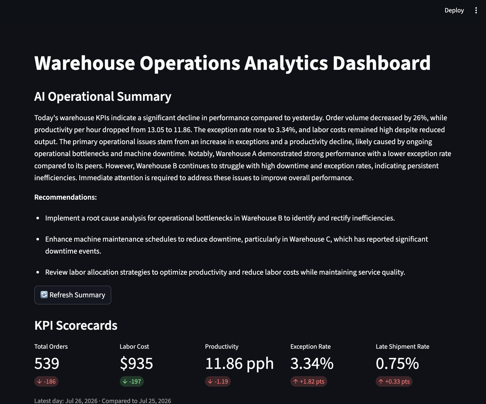
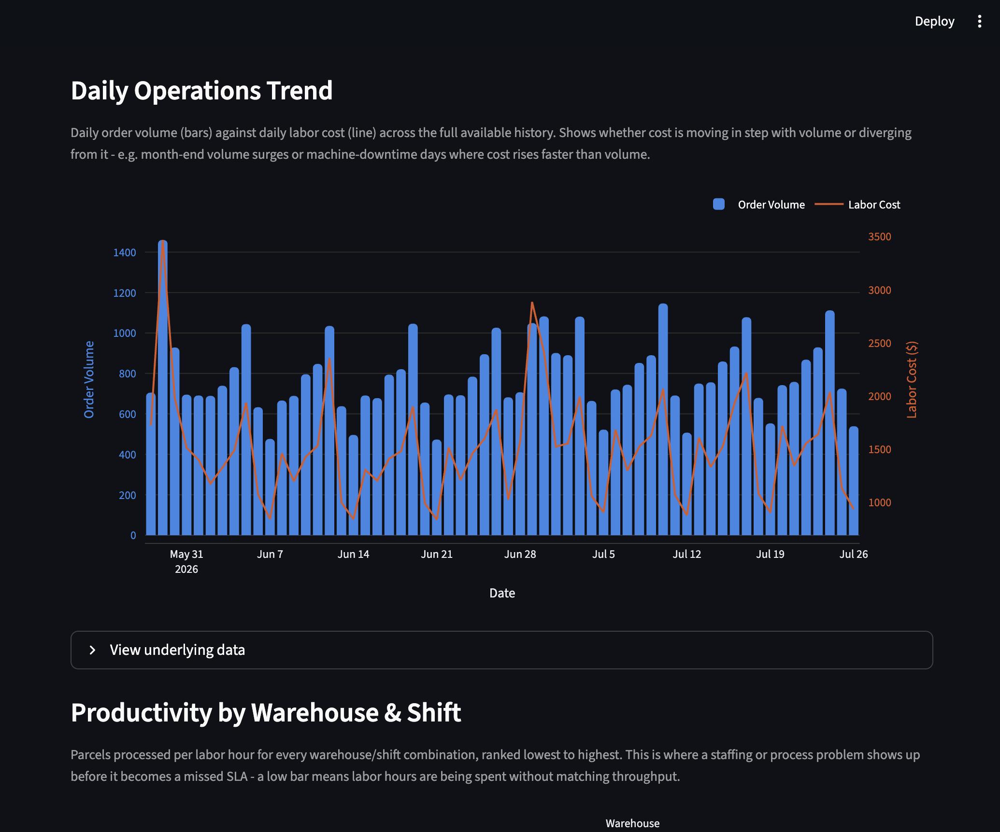
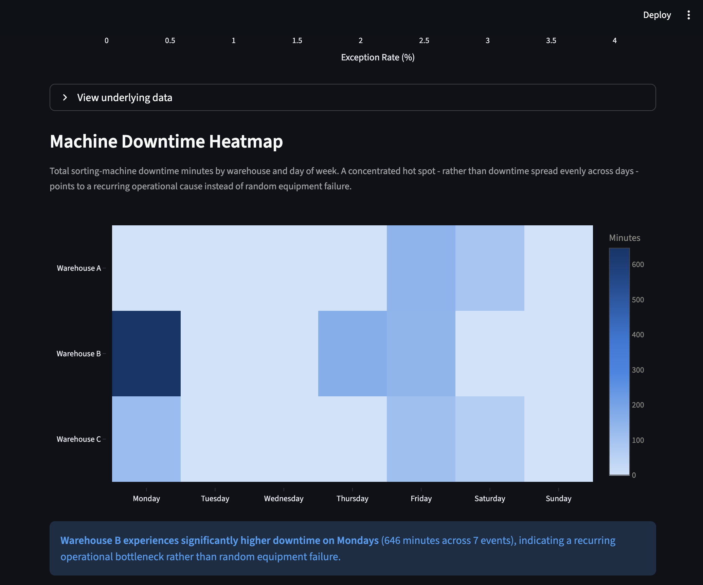
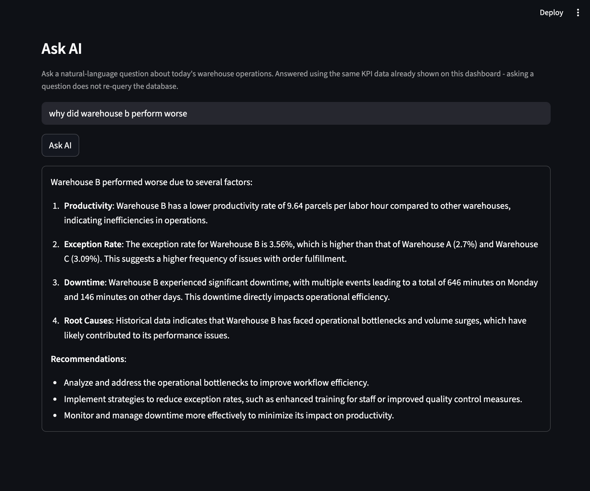

# 📦 AI-Powered Warehouse Operations Analytics Dashboard

An end-to-end warehouse operations analytics platform built with **Python, PostgreSQL, SQL, Streamlit, Plotly, and OpenAI API**.

This project simulates a parcel sorting hub and demonstrates how operational data can be transformed into actionable business insights through SQL analytics, interactive dashboards, root cause analysis, and AI-powered decision support.

---

# 📸 Dashboard Preview

## Main Dashboard



---

## AI Operational Summary



---

## Ask AI Assistant



---

## Root Cause Analysis



---

# 📖 Project Overview

Warehouse operations generate thousands of operational events every day, including parcel processing, labor utilization, machine downtime, shipment exceptions, and carrier performance.

This project demonstrates an end-to-end analytics workflow that converts raw warehouse operational data into business insights.

The workflow includes:

- Designing a PostgreSQL star schema database
- Loading operational data into a relational database
- Performing KPI analysis with SQL
- Building an interactive Streamlit dashboard
- Identifying operational bottlenecks through root cause analysis
- Generating AI-powered executive summaries
- Supporting natural language business questions with OpenAI

The project was designed as a portfolio project for **Business Analyst**, **Data Analyst**, and **Operations Analytics** roles.

---

# 🏢 Business Scenario

A parcel sorting hub processes thousands of packages every day.

Operations managers need visibility into key performance indicators such as:

- Parcel Volume
- Labor Cost
- Productivity
- Exception Rate
- Machine Downtime
- Carrier Performance

Instead of manually reviewing multiple reports, this dashboard consolidates operational metrics into one interface and uses AI to summarize daily warehouse performance.

---

# ✨ Key Features

### 📊 Interactive Dashboard

- KPI Scorecards
- Daily Operations Trend
- Productivity Analysis
- Labor Cost Trend
- Exception Rate Analysis
- Machine Downtime Heatmap
- Carrier Performance Ranking
- Root Cause Analysis

---

### 🗄 SQL Analytics

Implemented SQL queries to calculate warehouse KPIs including:

- Daily parcel volume
- Labor utilization
- Labor cost
- Productivity
- Exception rate
- Machine downtime
- Carrier performance

---

### 🤖 AI Features

Integrated the OpenAI API to provide:

- Executive operational summaries
- Business-focused recommendations
- Natural language warehouse Q&A

Example questions:

- Why did Warehouse B perform worse today?
- Which carrier has the highest late shipment rate?
- What should operations managers prioritize?
- What is today's biggest operational risk?

---

# 🏗 System Architecture

```
Synthetic Warehouse Data
            │
            ▼
    PostgreSQL Database
            │
            ▼
      SQL KPI Analytics
            │
            ▼
 Streamlit Dashboard
      │             │
      ▼             ▼
AI Summary      Ask AI
```

---

# 📈 Dashboard Sections

- KPI Scorecards
- Daily Operations Trend
- Productivity by Warehouse & Shift
- Labor Cost Trend
- Exception Rate Analysis
- Machine Downtime Heatmap
- Carrier Performance Ranking
- Operational Root Cause Analysis
- AI Operational Summary
- Ask AI Assistant

---

# 🛠 Technology Stack

| Category | Technology |
|-----------|------------|
| Language | Python |
| Database | PostgreSQL |
| Query Language | SQL |
| Dashboard | Streamlit |
| Visualization | Plotly |
| Data Processing | Pandas |
| AI | OpenAI API |
| Environment | python-dotenv |

---

# 📂 Project Structure

```
AI-Warehouse-Analytics
│
├── app/
│   ├── app.py
│   ├── db.py
│   ├── queries.py
│   ├── ai_summary.py
│   ├── ask_ai.py
│   └── sections/
│
├── sql/
│   ├── 01_schema.sql
│   ├── 02_load_data.sql
│   └── 03_kpi_queries.sql
│
├── scripts/
│   └── generate_data.py
│
├── data/
│
├── screenshots/
│
├── requirements.txt
│
└── README.md
```

---

# 🚀 Getting Started

## Clone the repository

```bash
git clone https://github.com/maxwell0037/ai-warehouse-analytics-dashboard.git
cd ai-warehouse-analytics-dashboard
```

---

## Install dependencies

```bash
pip install -r requirements.txt
```

---

## Configure environment variables

Create a `.env` file:

```env
OPENAI_API_KEY=your_api_key

DB_HOST=localhost
DB_PORT=5432
DB_NAME=warehouse_analytics
DB_USER=postgres
DB_PASSWORD=your_password
```

---

## Run the application

```bash
streamlit run app/app.py
```

---

# 📌 Sample Business Questions

The AI assistant can answer questions such as:

- Why did Warehouse B perform worse today?
- Which warehouse has the highest exception rate?
- Which carrier needs attention?
- Why are labor costs increasing?
- What operational risks should management prioritize today?

---

# 🚀 Future Improvements

Possible enhancements include:

- Cloud PostgreSQL deployment
- Docker containerization
- Authentication and user management
- Automated ETL pipeline
- Power BI integration
- Predictive analytics using machine learning
- Real-time warehouse monitoring

---

# 👨‍💻 Author

**Maxwell Zhou**

GitHub:

https://github.com/maxwell0037

---

# 📄 License

This project is licensed under the MIT License.